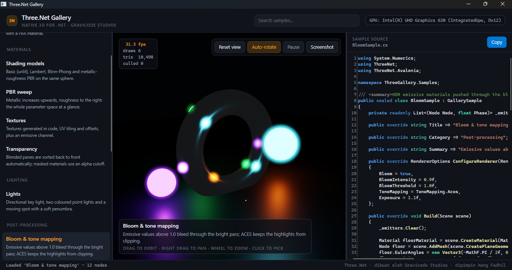
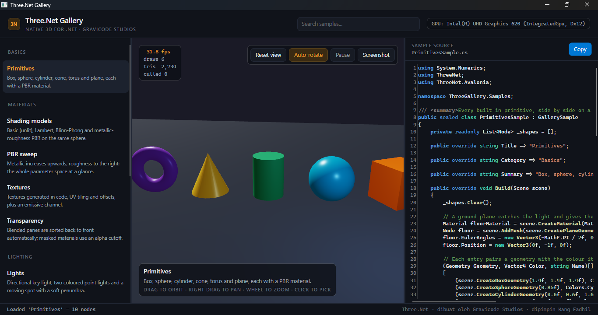
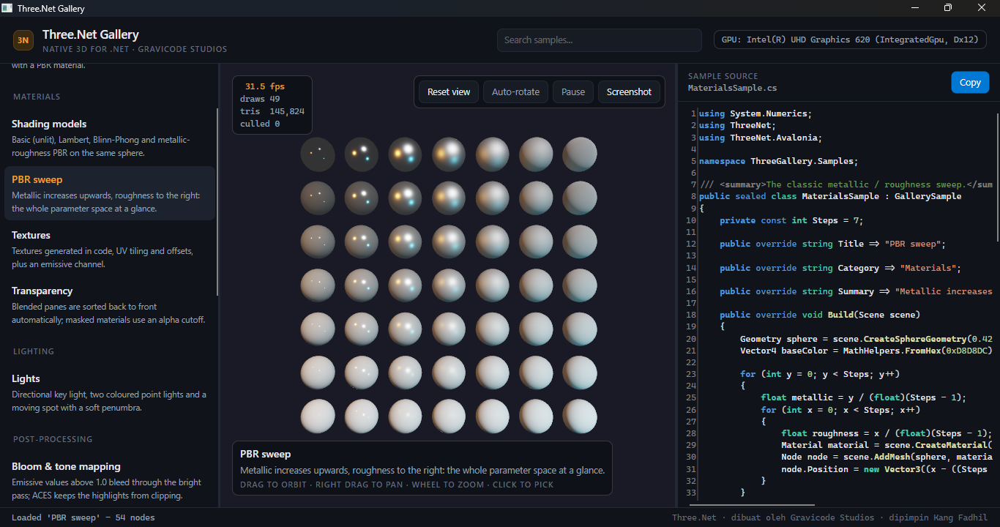
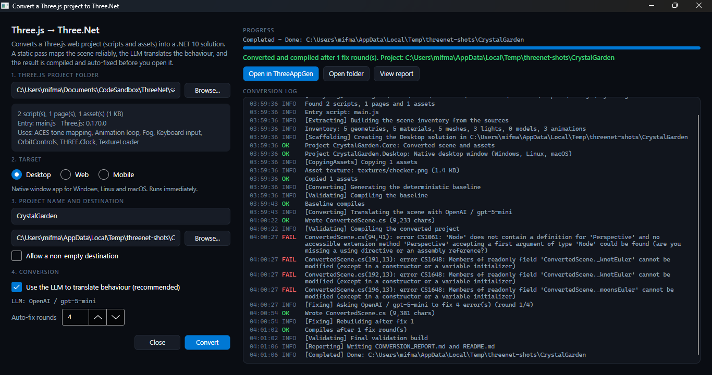
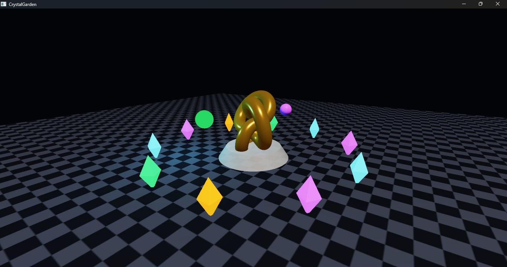
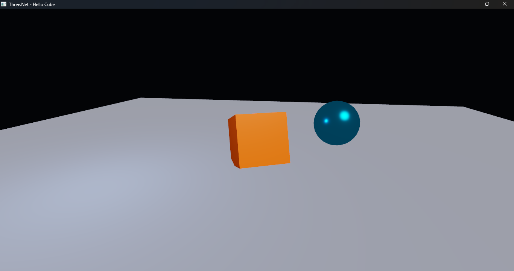
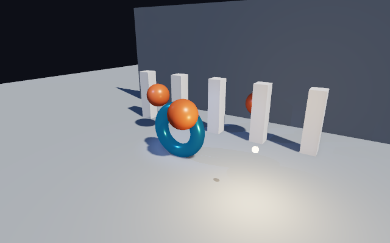
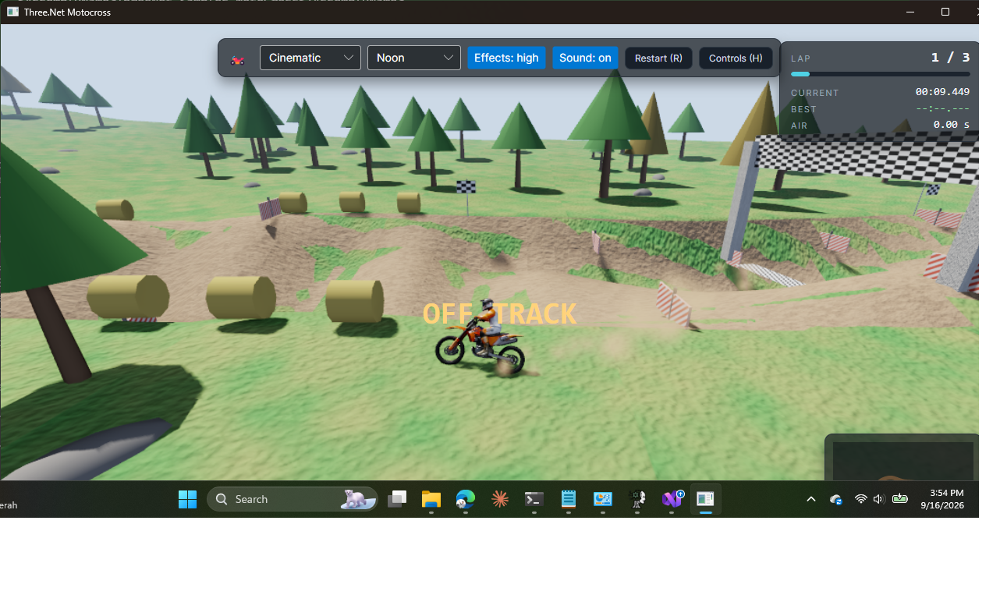
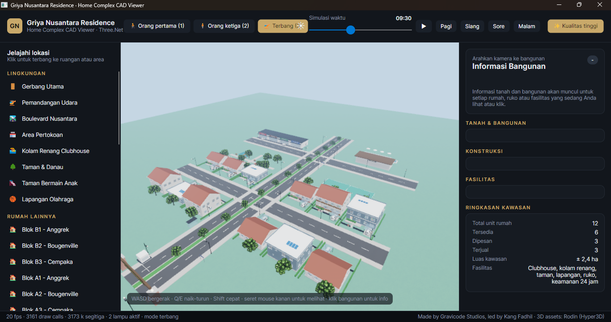
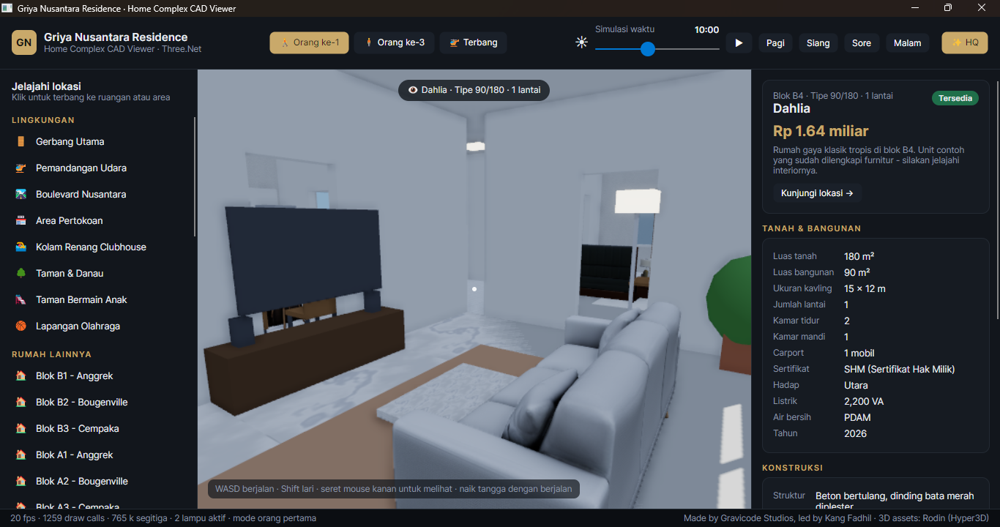

# Three.Net

**Native multiplatform 3D for .NET** - a Rust (wgpu) rendering core with a Three.js style C# API.
**3D native multiplatform untuk .NET** - inti rendering Rust (wgpu) dengan API C# bergaya Three.js.

Made by **Gravicode Studios**, led by **Kang Fadhil**.
Dibuat oleh **Gravicode Studios**, dipimpin **Kang Fadhil**.



## Screenshots / Tangkapan layar

| ThreeGallery - primitives | ThreeGallery - PBR sweep |
|---|---|
|  |  |
| **ThreeAppGen - editor + Jack** | **ThreeAppGen - Three.js converter** |
|  |  |
| **Converted Three.js app (desktop)** | **Hello Cube sample** |
|  |  |
| **Shadow maps + SSAO** | **Motocross sample (Rodin rider & bike)** |
|  |  |
| **Home Complex CAD - estate** | **Home Complex CAD - show unit interior** |
|  |  |

---

## English

### What is in this repository

| Part | Path | Status |
|---|---|---|
| Native core (Rust, wgpu 30): renderer, scene graph, PBR, shadow maps + SSAO, bloom + tone mapping, glTF/OBJ, raycasting, windowing, C ABI | `rust/threenet-core` | working, tested |
| .NET 10 binding (`ThreeNet`) | `src/ThreeNet` | working, tested |
| Native packaging (`ThreeNet.Native`) | `src/ThreeNet.Native` | builds the Rust core automatically |
| Avalonia control + orbit controls (`ThreeNet.Avalonia`) | `src/ThreeNet.Avalonia` | working |
| **ThreeGallery** - sample gallery with live source | `apps/ThreeGallery` | 13 samples |
| **ThreeAppGen** - AI code editor (Jack - The Code Bender) + Three.js converter | `apps/ThreeAppGen` | working |
| **Home Complex CAD Viewer** - housing estate explorer (interiors, day/night, land & building info) | `apps/HomeComplexCad` | working |
| Samples | `samples/` | Hello Cube, **Motocross** game, Three.js demo project |
| Tests | `tests/`, `rust/threenet-core/tests` | Rust, .NET and converter tests |

### Requirements

- .NET SDK 10
- Rust 1.88+ (`rustup`), used automatically by the build
- A GPU with DirectX 12 (Windows), Metal (macOS) or Vulkan (Linux)

### Quick start

```bash
# build everything (the Rust core is compiled by src/ThreeNet.Native)
dotnet build ThreeNet.slnx

# run a native window sample
dotnet run --project samples/ThreeNet.Samples.HelloCube

# run the sample gallery
dotnet run --project apps/ThreeGallery

# run the app generator
dotnet run --project apps/ThreeAppGen
```

```csharp
using System.Numerics;
using ThreeNet;

using Scene scene = new();
Node cube = scene.AddMesh(scene.CreateBoxGeometry(), scene.CreateMaterial(MaterialOptions.Pbr(Colors.Orange, 0.1f, 0.4f)));
Node sun = scene.AddLight(Light.Directional(Vector3.One, 3f));
sun.Position = new Vector3(4, 6, 4);
sun.LookAt(Vector3.Zero);
Node camera = scene.AddCamera(Camera.Perspective(55f.ToRadians()), new Vector3(0, 2, 6));
camera.LookAt(Vector3.Zero);

AppWindow window = new(WindowOptions.Default with { Title = "Hello Three.Net" });
float t = 0;
window.Render += (renderer, dt) =>
{
    cube.EulerAngles = new Vector3(0, t += dt, 0);
    renderer.Render(scene, camera);
};
window.Run();
```

### Converting a Three.js project

ThreeAppGen can turn a Three.js web project into a Three.Net solution for **desktop**, **web** or **mobile**:
`Tools > Convert Three.js project...` (or the **Convert Three.js** toolbar button). A static pass maps the
scene deterministically, the LLM translates behaviour, and the result is compiled and auto-fixed. See
[docs/threejs-conversion.md](docs/threejs-conversion.md).

### Documentation

Everything is in [`docs/`](docs/README.md): getting started, architecture, API reference, the native core,
ThreeGallery, ThreeAppGen and the Three.js converter. The roadmap is in [PLAN.md](PLAN.md) and the
development log in [Progress.md](Progress.md).

---

## Bahasa Indonesia

### Isi repository

| Bagian | Lokasi | Status |
|---|---|---|
| Inti native (Rust, wgpu 30): renderer, scene graph, PBR, shadow map + SSAO, bloom + tone mapping, glTF/OBJ, raycasting, window, C ABI | `rust/threenet-core` | berjalan, teruji |
| Binding .NET 10 (`ThreeNet`) | `src/ThreeNet` | berjalan, teruji |
| Paket native (`ThreeNet.Native`) | `src/ThreeNet.Native` | otomatis mem-build inti Rust |
| Control Avalonia + orbit controls (`ThreeNet.Avalonia`) | `src/ThreeNet.Avalonia` | berjalan |
| **ThreeGallery** - galeri contoh beserta kode sumbernya | `apps/ThreeGallery` | 13 contoh |
| **ThreeAppGen** - editor kode AI (Jack - The Code Bender) + konverter Three.js | `apps/ThreeAppGen` | berjalan |
| **Home Complex CAD Viewer** - penjelajah kompleks perumahan (interior, siang/malam, info tanah & bangunan) | `apps/HomeComplexCad` | berjalan |
| Contoh | `samples/` | Hello Cube, game **Motocross**, project demo Three.js |
| Test | `tests/`, `rust/threenet-core/tests` | test Rust, .NET dan konverter |

### Kebutuhan

- .NET SDK 10
- Rust 1.88+ (`rustup`), dipakai otomatis saat build
- GPU dengan DirectX 12 (Windows), Metal (macOS) atau Vulkan (Linux)

### Mulai cepat

```bash
dotnet build ThreeNet.slnx                                  # build semua (inti Rust ikut di-build)
dotnet run --project samples/ThreeNet.Samples.HelloCube     # contoh jendela native
dotnet run --project apps/ThreeGallery                      # galeri contoh
dotnet run --project apps/ThreeAppGen                       # app generator
```

### Konversi project Three.js

ThreeAppGen dapat mengubah project web Three.js menjadi solusi Three.Net untuk **desktop**, **web** atau
**mobile**: menu `Tools > Convert Three.js project...` (atau tombol **Convert Three.js** di toolbar). Tahap
statis memetakan scene secara deterministik, LLM menerjemahkan perilaku, lalu hasilnya di-compile dan
diperbaiki otomatis. Lihat [docs/threejs-conversion.md](docs/threejs-conversion.md).

### Dokumentasi

Semua ada di [`docs/`](docs/README.md). Roadmap ada di [PLAN.md](PLAN.md) dan catatan progres di
[Progress.md](Progress.md).

---

License: MIT. Three.Net - Gravicode Studios, led by Kang Fadhil.
