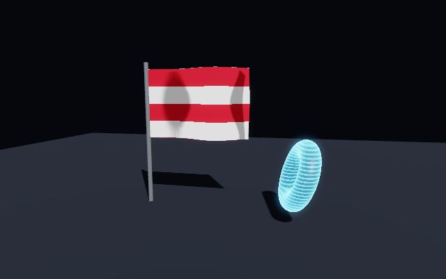
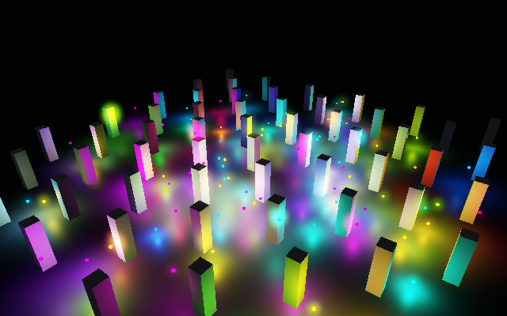
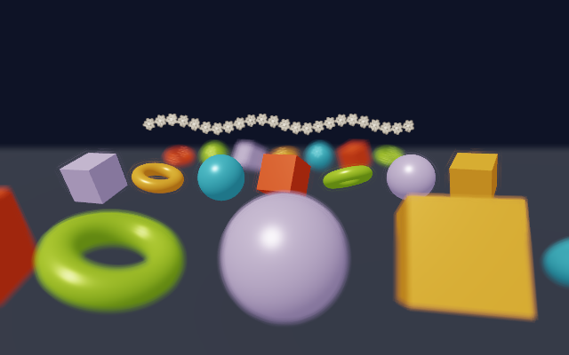

# Advanced rendering and assets / Rendering lanjutan dan aset

Custom shaders, the deferred renderer, camera effects, animation, FBX, compressed textures, texture
streaming and the asset cache. Every feature below has a ThreeGallery sample.

Shader kustom, deferred renderer, efek kamera, animasi, FBX, tekstur terkompresi, streaming tekstur dan
cache aset. Semua fitur di bawah punya contoh di ThreeGallery.



## Custom shaders

The built-in shader is split into modules (`common.wgsl`, `material.wgsl`, `forward.wgsl`,
`deferred_gbuffer.wgsl`). A custom shader supplies one or both **hooks**; everything else (lighting,
shadows, SSAO, fog, both render paths) keeps working.

```wgsl
// Object space position after deformation.
fn user_vertex(context: VertexContext) -> vec3<f32>
// Change the surface before lighting.
fn user_surface(context: SurfaceContext, surface: Surface) -> Surface
```

| Struct | Fields |
|---|---|
| `VertexContext` | `position`, `normal`, `uv`, `time`, `custom0`..`custom3` |
| `SurfaceContext` | `world_position`, `world_normal`, `view_direction`, `uv`, `screen_uv`, `time`, `custom0`..`custom3` |
| `Surface` | `albedo`, `alpha`, `normal`, `metallic`, `emissive`, `roughness`, `specular`, `occlusion`, `shininess`, `reflectance`, `shading_model`, `receive_shadow` |

A hook also has these in scope:

| Name | What it is |
|---|---|
| `custom_texture` | A texture slot the built-in shading never reads (`MaterialOptions.CustomMap`). It takes any float format, filterable or not, so it can hold an `Rgba32Float` field - but nothing may `textureSample` it, only `textureLoad`. |
| `sky_color(direction)` | The sky in a direction, exactly as the sky pass draws it, so a reflection shows the sky actually overhead. |
| `sample_environment(direction, lod)` | The environment map. |

Hooks can be written in **WGSL** or **GLSL** (GLSL is translated to WGSL with naga; the same struct and
field names apply). Sources are validated on the CPU when created, so errors surface as a
`ThreeNetException` with the compiler message instead of a GPU crash.

```csharp
Shader glow = scene.CreateShader("""
    Surface user_surface(SurfaceContext context, Surface surface) {
        surface.emissive = context.custom0.rgb * (0.5 + 0.5 * sin(context.time * 3.0));
        return surface;
    }
    """, ShaderLanguage.Glsl, "pulse");

Material material = scene.CreateMaterial(MaterialOptions.Pbr(Colors.White) with
{
    Shader = glow,
    Custom0 = new Vector4(0.2f, 0.8f, 1f, 0f),   // free parameters: custom0 / custom1
});

glow.Update(newSource);          // hot reload; on error the previous version stays active
string wgsl = glow.CompiledWgsl; // inspect what the GLSL became
```

## Shadows from every light type

Directional lights use cascades, spot lights a single perspective map, and point lights a cube of six
faces picked per pixel from the major axis of the light-to-fragment vector:

```csharp
scene.AddLight(Light.Point(Vector3.One, 30f, range: 14f) with { CastShadow = true });
```

Layers are allocated on demand: eight by default (three cascades plus a few spot lights), growing to
sixteen when a scene has point lights, so a cube map costs memory only where one is used. `FrameStats.ShadowLayers`
reports what a frame planned - six per shadowed point light.

## The sky

The renderer draws the sky itself, as **one triangle at the far plane** with the depth test on and depth
writes off, so it fills exactly the pixels no geometry claimed.

```csharp
scene.Environment = scene.Environment with
{
    Sky = SkyMode.Procedural,       // Color (the plain background), Texture, Procedural
    SunDirection = sunDirection,    // the sky follows the sun, including below the horizon
    SkyIntensity = 1f,
    SkyHaze = 0.3f,                 // thickens the air near the horizon
    SkyClouds = 0.35f,
    SkyRotation = 0f,               // spins a Texture sky about the vertical axis
};
```

`Procedural` gives a height gradient, horizon haze, forward scattering around the sun, a sun disc bright
enough to bloom, a drifting cloud sheet, and - once the sun is below the horizon - a moon and stars.
`Texture` uses `Environment.EnvironmentMap` instead.

Why a pass and not a dome mesh: a dome is fogged like any other surface, and it lands in the depth prepass
that SSAO and depth of field read. A pass at the far plane has neither problem and costs one triangle.

The same function lives in the shading library as `sky_color(direction)`, so a custom shader can ask for the
sky in a direction and get the sky actually overhead - which is how `EffectShaders.Water` reflects it.

## Debug views

`RendererOptions.DebugView` replaces the shaded image with one channel of the surface, in both render paths.
Exposure, tone mapping, bloom and the camera effects are skipped while a view is on, so the values reach the
screen unchanged (encoded to sRGB by the output surface, like any other colour).

```csharp
renderer.Options = renderer.Options with { DebugView = DebugView.WorldNormal };
```

| View | Shows |
|---|---|
| `BaseColor` | Albedo with the lighting removed |
| `WorldNormal` | World space shading normal, remapped to 0..1 (normal maps and custom shaders included) |
| `Roughness`, `Metallic` | The value the lighting was given, as grey |
| `Occlusion` | Material occlusion multiplied by SSAO when it is on |
| `Emissive` | Emission only |
| `Depth` | Linear view depth over the camera range, square rooted for contrast |
| `Lighting` | Lighting with the albedo taken out (white surfaces) |
| `Shadow` | Shadow visibility of every shadow casting light |
| `Uv` | Texture coordinates; the deferred path draws magenta, because the G-buffer carries no UVs |

`RendererOptions.Wireframe` draws every surface as lines whatever its material says, for the same purpose. It
needs an adapter with line polygons (`GpuCapabilities.WireframeRendering`).

## Frame timing and capabilities

```csharp
GpuCapabilities capabilities = renderer.Capabilities;
if (capabilities.TimestampQueries)
{
    Console.WriteLine($"{renderer.Stats.GpuTimeMs:F2} ms on the GPU");
}
```

`FrameStats.GpuTimeMs` comes from timestamp queries around the frame's command buffer. The result is read back
without stalling, so it lags a frame or two behind and stays `0` on adapters without the feature - Metal on
Apple Silicon is one of them, so check `TimestampQueries` before showing the number as a measurement.
`Renderer.Capabilities` also reports the backend and device type, the vendor and device ids, the largest
texture and buffer, the highest MSAA count the HDR target supports, which compressed texture families upload
natively, and whether float textures can be filtered - enough to offer only the settings that work on the
machine in front of you. `Renderer.AdapterName` and `Renderer.AdapterDriver` name the GPU and its driver.

## Deferred renderer

`RendererOptions.RenderPath = RenderPath.Deferred` writes opaque geometry into a G-buffer (five
`Rgba16Float` targets plus depth) and lights every pixel in one fullscreen pass. Up to 128 lights are
supported in both paths; with many lights deferred is much cheaper. Transparent objects and lines are drawn
forward on top. MSAA does not apply to the deferred path.



## Depth of field and motion blur

```csharp
options with
{
    DepthOfField = true,
    DofFocusDistance = 11f,   // metres from the camera
    DofFocusRange = 2.5f,     // sharp band around the focus distance
    DofMaxBlur = 16f,         // radius in pixels
    MotionBlur = true,        // camera motion, reprojected from depth
    MotionBlurStrength = 0.8f,
    MotionBlurSamples = 12,
}
```

Both run on the HDR image before bloom and tone mapping, in forward and deferred rendering.



## Animation

Clips hold channels (translation, rotation, scale) with `Step`, `Linear` or `CubicSpline` interpolation.
glTF and FBX imports create clips and skins automatically; clips can also be built in code.

```csharp
AnimationClip clip = scene.CreateAnimation("bob")
    .AddTranslation(node, [0f, 1f, 2f], [Vector3.Zero, Vector3.UnitY, Vector3.Zero])
    .AddRotation(node, [0f, 2f], [Quaternion.Identity, Quaternion.CreateFromAxisAngle(Vector3.UnitY, MathF.PI)]);

AnimationPlayer player = clip.Play(loop: true);
player.Speed = 1.5f;

// every frame
scene.UpdateAnimations(deltaSeconds);
```

`scene.Animations` lists imported clips (`Name`, `Duration`). Skinned meshes are deformed on the CPU when a
pose changes, so they render (and cast shadows) through the normal pipelines.

### Morph targets (blend shapes)

A geometry can carry morph targets: dense per-vertex deltas that are mixed into the base mesh by weight.
Facial expressions are the usual reason, and the usual way they arrive is a glTF file - the importer reads
the targets, their names from `mesh.extras.targetNames`, the node's starting weights, and any
`MorphTargetWeights` animation channel that drives them.

```csharp
Node head = model.Root.Find("Face")!;
IReadOnlyList<string> shapes = head.Geometry!.MorphTargetNames;   // "smile", "jawOpen", ...

head.SetMorphWeight(0, 0.8f);                 // one shape
head.SetMorphWeights([0.8f, 0.2f, 0f, 1f]);   // or the whole pose at once

// Or build them yourself, with one delta per vertex:
geometry.AddMorphTarget("stretch", positionDeltas, normalDeltas);
```

Deformation happens on the CPU, before skinning, so **the two stack**: a face can be smiling while its head
is animated by a skeleton. A pose whose weights have not changed is skipped, so holding an expression costs
nothing. Bounds and raycasts see the deformed mesh, as they do with skinning.

## FBX

`scene.LoadFbx(path or bytes)` or `scene.LoadModel(path)` (chooses by extension) imports binary and ASCII
FBX: meshes with normals/UVs, Lambert and Phong materials, embedded or external textures, the node
hierarchy with the full FBX transform stack, skin clusters and animation stacks. Units and the up axis are
converted to Y-up metres.

## Compressed textures (KTX2 / Basis Universal)

`LoadTexture` accepts `.ktx2` and `.basis` besides PNG/JPEG/BMP/TGA/HDR:

- KTX2 with raw formats (RGBA8, RGBA16F, RGBA32F), BC1/3/4/5/7, ETC2 and ASTC 4x4 blocks, optionally
  zstd or zlib supercompressed.
- Basis Universal ETC1S (BasisLZ) and UASTC, in `.basis` or KTX2 containers.

Textures stay compressed in memory until upload. Basis data is transcoded to BC7, ETC2 or ASTC depending
on what the GPU supports, and block formats the GPU cannot sample are decoded to RGBA8 on the CPU.

## Texture streaming and the asset cache

```csharp
Texture albedo = scene.LoadTextureAsync("textures/ground_4k.png");  // returns immediately
// A grey placeholder is used until the image is decoded on a worker thread.
// Rendering swaps finished textures in at the start of a frame.
scene.SetStreamingBudget(2);          // finished textures applied per frame
if (albedo.State == TextureState.Failed) Console.WriteLine(albedo.LoadError);
scene.FinishStreaming(TimeSpan.FromSeconds(5));   // e.g. before a screenshot

Texture shared = scene.LoadTextureCached("textures/bark.png");      // loaded once per path + colour space
ImportResult tree = scene.LoadModelCached("models/tree.glb");       // imported once, then cloned
Console.WriteLine(scene.AssetStats);  // pending, cached, hits, misses, streamed
scene.ClearAssetCache();
```

`LoadModelCached` keeps a hidden prototype and returns a clone that shares geometry, materials and
textures. Models with animations or skins are imported every time, because clips target the nodes of one
import.

---

Three.Net - Gravicode Studios, led by Kang Fadhil.
