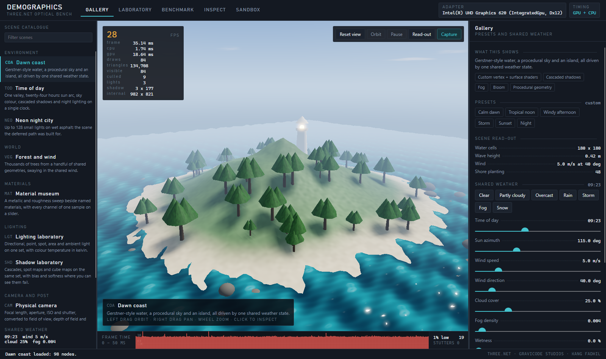
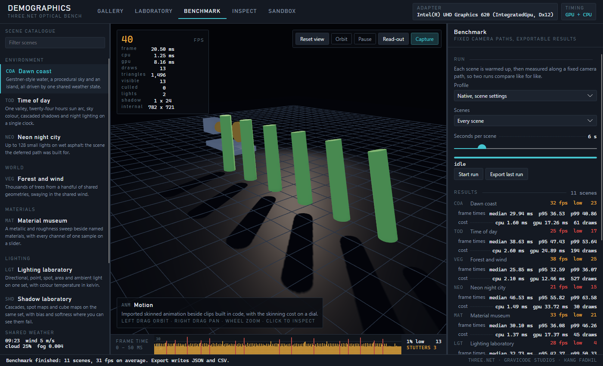

# DemoGraphics / Bengkel grafis DemoGraphics

```bash
dotnet run --project samples/DemoGraphics
dotnet run --project samples/DemoGraphics -- --check     # build and render every scene offscreen
```



An instrument, not a slideshow. DemoGraphics shows what the renderer can do, lets you take each part apart
while it runs, measures what that costs, and writes the result down. Fifteen scenes, five benches, one shared
weather state, and a report you can reproduce.

DemoGraphics adalah alat ukur, bukan presentasi: lima belas scene, lima mode kerja, satu keadaan cuaca bersama,
dan hasil pengukuran yang bisa diekspor dan diulang.

Made by Gravicode Studios, led by Kang Fadhil.

---

## The five benches

| Bench | What it is for |
|---|---|
| **Gallery** | The scene as intended: presets, the shared weather, quality presets and the A/B split. |
| **Laboratory** | Every parameter the scene declares, plus the whole renderer - shadows, SSAO, bloom, camera effects, tone mapping - on live controls. |
| **Benchmark** | Fixed camera paths through a set of scenes, with 1% lows, percentiles and stutters, exported as JSON and CSV. |
| **Inspect** | Debug views, wireframe, the pass ladder for the current frame, click-to-inspect and what this GPU can do. |
| **Sandbox** | An empty stage: spawn, drag, light, drop and save as a scene document. |

**The read-out.** The strip under the viewport is one column per frame, newest on the right, coloured by the
budget it fits: cyan under 8.3 ms, green under 16.7, amber under 33, red past it. A frame rate number tells
you how fast; the ribbon tells you how *even*, which is the part you feel. Beside it are the 1% low and the
stutter count, both computed from the same buffer the benchmark exports.

**Colour means one thing.** Cyan is measured and inside budget, amber is live or changed by hand, violet is
inspection, crimson is over budget or unsupported, lime passed. Axis colours (X red, Y green, Z blue) appear
only where an axis is meant.

## The scenes

| Code | Scene | What it demonstrates |
|---|---|---|
| `COA` | Dawn coast | Gerstner-style water (vertex + surface shader sharing one wave function), the engine sky, terrain splatting, cascaded shadows, fog |
| `TOD` | Time of day | A 24 hour clock driving sun arc, sky, exposure and night lighting; point light cube shadows; timelapse |
| `SKY` | Sky and horizon | The sky pass on sliders - sun, haze, clouds, moon, stars - with a roughness sweep and still water showing what reflects it |
| `VEG` | Forest and wind | Up to 12 000 trees from a handful of shared geometries, frustum culling, a distance cut-off, wind in a vertex shader |
| `NEO` | Neon night city | Up to 128 small lights on wet asphalt: the deferred path, emissive signage, bloom, fog |
| `MAT` | Material museum | A metallic / roughness sweep, named materials, and every channel of one sample on a slider; procedural textures and normal maps |
| `LGT` | Lighting laboratory | Directional, point, spot, area and ambient light with colour temperature in kelvin; all three shadow paths in one frame |
| `SHD` | Shadow laboratory | Cascades, spot maps and cube maps with bias, normal bias and softness - including the settings that make them fail |
| `CAM` | Physical camera | Focal length, aperture, ISO and shutter converted to field of view, depth of field and exposure |
| `WAT` | Water simulation | A wave equation on a height field: ripples that spread, reflect and die, caustics on the pool floor, things that float. Click the water |
| `FIR` | Volumetric fire | A ray marched flame with embers and smoke, and a point light that gutters with it |
| `VFX` | Particle laboratory | Emitter shapes, curl noise turbulence, attractors and colour over life, on geometry rewritten every frame |
| `PHY` | Physics yard | Rapier rigid bodies: a brick wall, a ramp, barrels and a kinematic wrecking ball, with contacts counted |
| `ANM` | Motion | Imported skinned glTF animation beside clips built in code, with the skinning cost on a dial |
| `FAC` | Facial expressions | Morph targets: one slider per blend shape read off the model, mixed into named expressions, with an idle blink |

Every scene follows the same contract (`Framework/DemoScene.cs`): build, apply parameters, apply the weather,
update, measure, reset, plus a deterministic camera path for the benchmark. Parameters are declared as data
(`DemoParameter`), so the control sheet, the presets and the capture sidecar all read the same list and no
scene builds any UI.

```csharp
public sealed class MyScene : DemoScene
{
    public MyScene() => Declare(DemoParameter.Slider("waveHeight", "Wave height", 0.4f, 0f, 2.5f, "m"));

    public override string Id => "MYS";              // the code in reports and captures

    protected override void OnBuild() { /* create nodes in Scene */ }

    protected override void OnApplyParameters() { /* push P("waveHeight") into the scene */ }
}
```

Add it to `SceneCatalog.All` and it appears in the catalogue, the laboratory and the benchmark.

## Shared weather

Time of day, sun azimuth, wind, cloud cover, fog, wetness, precipitation, snow and temperature live in one
`EnvironmentState`. Raising the wind moves the water, the trees, the grass and the smoke together; moving the
clock turns the sun, recolours the sky, changes the exposure the scene needs and switches the night lights on.
Weather presets (clear, overcast, rain, storm, fog, snow) set them all at once.

## Benchmark and capture



A run warms each scene up, then measures it along its own camera path, so two runs compare like for like.
Results carry average, minimum, maximum and 1% low frame rates, median / p95 / p99 frame times, CPU and GPU
time, draw calls, triangles and a stutter count, and export to
`Documents/ThreeNet/DemoGraphics/benchmark-<timestamp>.json` and `.csv` with the adapter, driver, backend,
quality profile and internal resolution in the header.

A full pass over the flagship scenes on an Intel UHD 620 at 782x721 internal, for scale: 32 fps on the coast,
38 in the forest, 25 through the day cycle and 21 in the neon city, where the GPU time per frame is 33.7 ms.

**Capture** writes a PNG beside a JSON sidecar holding the scene, the preset, every parameter, the weather, the
render settings, the adapter and the frame stats - enough to take the same shot again.

## What the app needed from the library

Everything below was added to Three.Net for this app, and all of it is part of the public API:

| Addition | Why |
|---|---|
| `SceneEnvironment.Sky` (0.9.0) | The sky was a dome mesh here, which fog ate into and which polluted the depth prepass. It is a renderer pass now - see [advanced-rendering.md](advanced-rendering.md#the-sky). |
| `ThreeNet.Effects` (0.9.0) | `WAT`, `FIR` and `VFX` all used to carry their own copy of the water, the fire and the particles. They are library types now - see [effects.md](effects.md). |
| Morph targets (0.9.0) | `FAC` needs blend shapes on an imported character - see [advanced-rendering.md](advanced-rendering.md#morph-targets-blend-shapes). |
| `RendererOptions.DebugView` | Replaces the shaded image with one channel of the surface - base colour, world normal, roughness, metallic, occlusion, emissive, depth, lighting only, shadow mask, UV. See [advanced-rendering.md](advanced-rendering.md#debug-views). |
| `RendererOptions.Wireframe` | Draws every surface as lines whatever its material says, so any scene can be inspected as a mesh. |
| `FrameStats.GpuTimeMs` and `Renderer.Capabilities` | GPU frame timing from timestamp queries, and what the adapter actually supports, so the app can measure honestly and grey out what is not there. |

## Checking it without a window

`--check` builds every scene offscreen, compiles every custom shader, renders both paths and a debug view,
applies every preset and prints what each scene costs:

```text
COA  Dawn coast             nodes     98  draws    80  tris   114,124  lights   3  shadow layers  3  frame  12.4 ms
VEG  Forest and wind        nodes   1522  draws   427  tris   130,574  lights   2  shadow layers  3  frame   9.5 ms
```

It exits non-zero if any scene fails, which makes it a usable smoke test in CI.

---

Three.Net - Gravicode Studios, led by Kang Fadhil.
