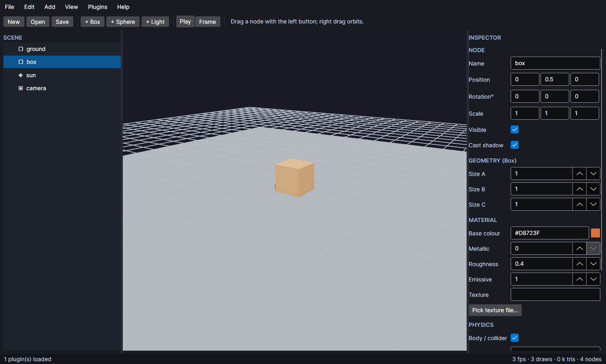

# ThreeEditor and plugins / ThreeEditor dan plugin

```bash
dotnet run --project apps/ThreeEditor
```



A scene editor built on the library itself: the viewport is a `ThreeNetView`, picking and dragging use
`InteractionManager`, and play mode runs the Rapier physics. Scenes are plain JSON
([`SceneDocument`](#scene-documents)), so they can also be built, generated or tested without the editor.

Editor scene yang dibangun di atas library: viewport memakai `ThreeNetView`, seleksi dan drag memakai
`InteractionManager`, mode play menjalankan fisika Rapier. Scene disimpan sebagai JSON.

## The window

| Area | What it does |
|---|---|
| **Scene tree** | The node hierarchy; select, and the inspector follows. Icons mark meshes (▢), lights (◈) and cameras (▣). |
| **Viewport** | Right drag orbits, wheel zooms, left click selects, left drag moves the node on the ground plane. Shadows and SSAO are on; `View` toggles them and the grid. |
| **Inspector** | Name, transform, visibility and shadows; geometry sizes; material colour, metallic, roughness, emissive and texture; light type, intensity, range, colour, shadows; camera field of view and "active"; physics body type, collider shape and material. Changes apply immediately. |
| **Toolbar / menus** | New / open / save, add primitives, lights, cameras and imported models, undo & redo (Ctrl+Z / Ctrl+Y), duplicate (Ctrl+D), delete, frame selection (F), play / stop, screenshot, plugin commands. |

**Play** steps physics on the live scene; **Stop** restores the scene exactly as it was, so play mode is safe
to use while editing. Undo keeps the last 100 document states.

## Scene documents

`ThreeNet.Scenes.SceneDocument` is an editable description of a scene - geometries (primitives or model
files), textures, materials, a node tree with lights, cameras and physics, plus environment settings.

```csharp
SceneDocument document = SceneDocument.Load("level.json");
SceneBuildResult built = document.Build(scene);      // creates everything in a live Scene
Node crate = built.Nodes["crate-1"];
foreach (string warning in built.Warnings) Console.WriteLine(warning);   // missing assets, never throws

document.Nodes.Add(new NodeDefinition { Id = document.NextId("crate"), GeometryId = "box", MaterialId = "wood" });
document.Save("level.json");
```

- Asset paths are relative to the document (`BaseDirectory`), so scenes stay portable.
- `SceneDocument.CreateDefault()` is the editor's starter scene (ground, box, sun, camera).
- Helpers: `AllNodes()`, `Find(id)`, `ParentOf(node)`, `Remove(node)`, `NextId(prefix)`.

## Plugins

Plugins are .NET assemblies that add commands and importers. Drop the DLL into the editor's `plugins`
folder (or call `PluginManager.LoadDirectory`); each plugin is loaded into its own collectible
`AssemblyLoadContext`, so `Unload` really releases it and "Reload plugins" picks up a rebuild.

```csharp
public sealed class ScatterPlugin : IThreeNetPlugin
{
    public string Name => "Scatter tools";

    public void Initialize(IPluginHost host)
    {
        host.AddCommand(new PluginCommand("Scatter 24 boxes", "Generate", context =>
        {
            context.Document.Nodes.Add(...);   // edit the document
            context.Report("scattered 24 boxes");
            context.RequestRebuild?.Invoke();  // refresh the viewport
        }));

        host.AddImporter(new PluginImporter("Point cloud (.points)", [".points"], (context, path) => ...));
    }
}
```

- `PluginContext` carries the document, the current selection, the live `Scene`, a logger and a rebuild
  request; a plugin never has to know about the UI.
- Commands appear in the editor's **Plugins** menu, grouped by category; importers extend
  **File > Import (plugin formats)**.
- Hosting plugins in your own app is three lines: `new PluginManager("MyApp")`, `LoadDirectory(...)`,
  then `Run(command, new PluginContext(document))`.
- The working example is `samples/ThreePlugin.Sample` (scatter boxes, ring of lights, `.points` importer);
  the editor builds it into its own `plugins` folder.

---

Three.Net - Gravicode Studios, led by Kang Fadhil.
