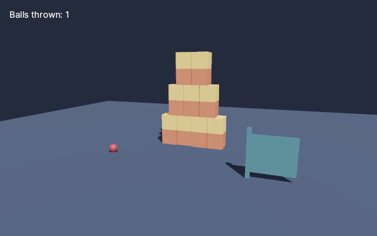

# Extensions: physics, spatial audio, networking, XR / Ekstensi



## Physics (`Scene.Physics`, Rapier)

Bodies and colliders attach to nodes. `Step(delta)` advances in fixed steps (default 1/60 s), writes
dynamic body poses to their nodes and moves kinematic bodies to where their nodes are.

```csharp
PhysicsWorld physics = scene.Physics;

Node ground = scene.CreateNode(name: "ground");
physics.AddCollider(ground, ColliderOptions.Box(new Vector3(50, 0.5f, 50)));           // static

Node crate = scene.AddMesh(box, wood);
crate.Position = new Vector3(0, 5, 0);
physics.Add(crate, RigidBodyOptions.Dynamic, ColliderOptions.Box(new Vector3(0.5f)) with { Friction = 0.7f });

physics.Contact += c => { if (c.Started && c.Involves(crate)) PlayThud(c.Other(crate)); };

// every frame
physics.Step(deltaSeconds);
```

| Feature | API |
|---|---|
| Body types | `RigidBodyOptions.Dynamic`, `Fixed`, `Kinematic` (+ damping, gravity scale, CCD, locked rotations, sleeping, initial velocity) |
| Shapes | `ColliderOptions.Box`, `Sphere`, `Capsule`, `Cylinder`, `TriangleMesh(geometry)`, `ConvexHull(geometry)`; offset/rotation, friction, restitution, density, sensors, collision groups (`Membership` / `Filter`) |
| Forces | `ApplyImpulse`, `AddForce`, `SetVelocity`, `GetVelocity`, `Teleport`, `IsSleeping` |
| Queries | `Raycast(origin, direction, maxDistance, exclude)` → `PhysicsHit` |
| Events | `Contact` event / `TakeContactEvents()` (started, stopped, sensor) |
| Joints | `AddJoint(JointType.Fixed / Ball / Hinge / Slider, a, b, anchorA, anchorB, axis)` |
| Characters | kinematic body + capsule, `MoveCharacter(node, desired, dt)` → applied movement and grounded flag (slides along walls, climbs slopes, auto-steps, snaps to ground); `ConfigureCharacters` |

Shapes use world units; triangle meshes and convex hulls take the node's world scale when created.
Removing a node removes its body on the next step.

## Spatial audio (`AudioEngine`)

```csharp
using AudioEngine audio = AudioEngine.Open();                  // default output device
AudioClip engineLoop = audio.LoadClip("sounds/engine.ogg");    // WAV, OGG Vorbis, MP3, FLAC
AudioClip beep = audio.CreateClip(samples, channels: 1, sampleRate: 48000);

SoundInstance engine = audio.Play(engineLoop, SoundOptions.On(carNode));   // follows the node, loops
audio.Play(beep, SoundOptions.At(new Vector3(3, 0, -2)) with { Pitch = 1.2f });
audio.Play(music, SoundOptions.Flat(gain: 0.4f, loop: true));

// every frame: listener on the camera, node sounds follow their nodes
audio.Update(scene, camera, deltaSeconds);
engine.Update(o => o with { Pitch = 0.6f + rpm / 9000f });
```

- Software mixer: equal power panning relative to the listener orientation, inverse distance attenuation
  (`MinDistance`, `MaxDistance`, `Rolloff`), Doppler from node / listener velocities (`DopplerFactor`,
  `SpeedOfSound`), distance air absorption, smoothed gain changes, soft clipping.
- `SoundInstance`: `IsPlaying`, `Time` (seek), `Options`, `Update`, `Stop`. One-shots release themselves.
- `AudioEngine.CreateOffline(sampleRate)` + `Render(span)` mixes without a device (tests, bouncing).

## Networking (`ThreeNet.Networking`)

A small UDP session: one host, any number of clients. The host relays client traffic.

```csharp
using NetworkSession host = NetworkSession.Host(port: 7777, name: "host");
using NetworkSession client = NetworkSession.Connect("192.168.1.10", 7777, name: "player 2");

host.Replicate(hostCar, networkId: 1, owned: true);        // the host moves this node
client.Replicate(remoteCar, networkId: 1, owned: false);   // the client shows it, interpolated

client.MessageReceived += m => Console.WriteLine($"{m.Sender.Name}: {Encoding.UTF8.GetString(m.Data)}");
host.Send(Encoding.UTF8.GetBytes("race starts"));          // reliable + ordered by default

// every frame on each peer
session.Update();
```

- Transform snapshots at `NetworkOptions.TickRate`, shown `InterpolationDelay` behind real time
  (position lerp, rotation slerp, snapping on teleports).
- Messages: reliable ordered (acks + resends, `RoundTripTime`) or unreliable; to everybody or one peer.
- Events: `Connected`, `PeerConnected`, `PeerDisconnected`, `MessageReceived`, `Closed` (connect timeout,
  host gone). Heartbeats and `Timeout` detect dropped peers.
- No encryption or NAT traversal: use it on LANs or behind your own relay.

## VR / AR (OpenXR)

- `XrRuntime.Probe()` opens the OpenXR loader dynamically and reports the runtime, the connected head
  mounted display, tracking capabilities and the recommended per-eye resolution.
- `Camera.OffAxis(left, right, up, down)` renders asymmetric frusta (OpenXR field of view convention).
- `StereoRig(scene, head, ipd, fov, focalDistance)` creates two eye cameras converging on a focal plane;
  `RenderSideBySide(renderer)` produces a side-by-side image for 3D displays and previews.
- **Not yet**: OpenXR sessions, swapchains and head pose tracking (frame submission to a headset needs a
  Vulkan / D3D12 interop path from wgpu). See PLAN.md.

---

Three.Net - Gravicode Studios, led by Kang Fadhil.
