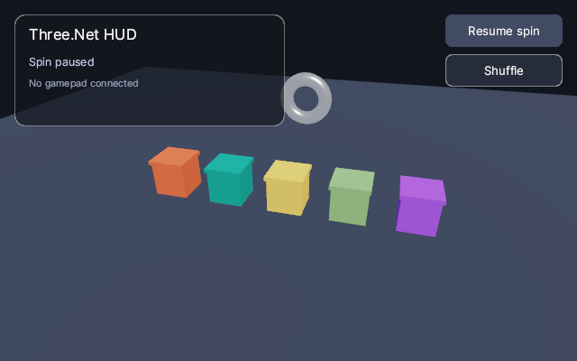

# Interactivity: node events, HUD and gamepads / Interaktivitas

Three.Net handles input without a UI toolkit: pointer events on 3D nodes, a native screen space HUD drawn
by the renderer, and gamepads. `ThreeNetView` (Avalonia) wires everything up; with `AppWindow` you feed
input events yourself.

Three.Net menangani input tanpa toolkit UI: event pointer pada node 3D, HUD native yang digambar renderer,
dan gamepad. `ThreeNetView` (Avalonia) menyambungkan semuanya; dengan `AppWindow` event input diteruskan
sendiri.



## Node events (`InteractionManager`)

```csharp
InteractionManager interaction = view.Interaction!;          // ThreeNetView creates one per scene

interaction
    .OnPointerEnter(crate, e => highlight(e.Target))
    .OnPointerLeave(crate, e => unhighlight(e.Target))
    .OnClick(crate, e => Console.WriteLine($"clicked {e.HitNode!.Name} at {e.Hit!.Value.Point}"))
    .OnDoubleClick(crate, e => focus(e.Target))
    .MakeDraggable(crate, DragMode.GroundPlane, e => Console.WriteLine(e.DragPoint));
```

- Events: `PointerEnter`, `PointerLeave`, `PointerDown`, `PointerUp`, `PointerMove`, `Click`, `DoubleClick`,
  `DragStart`, `Drag`, `DragEnd` (`On(node, kind, handler)` registers any of them).
- **Bubbling**: a handler on a node also receives events for hits on its descendants, so a whole imported
  model is clickable through its root. `e.Target` is the node whose handler runs, `e.HitNode` the mesh
  under the pointer; set `e.Handled = true` to stop at the current node.
- **Dragging**: `DragMode.CameraPlane` moves in the plane facing the camera, `GroundPlane` keeps the height,
  `EventsOnly` just reports `DragPoint` / `DragDelta`. A drag starts after `ClickTolerance` pixels and
  suppresses the click. While dragging, `ThreeNetView` marks pointer events handled so `OrbitController`
  does not rotate.
- `HoveredNode`, `IsDragging`, `RaycastOptions` (layers, distance) and the global `Event` are available.
- With `AppWindow`: `window.Input += (r, e) => interaction.HandleInput(e, new Vector2(r.Width, r.Height));`

## HUD overlay (`Scene.Overlay`)

The overlay is drawn by the native renderer after tone mapping, so it works in every host (Avalonia,
native window, offscreen screenshots). Elements are pixel rectangles anchored to the viewport or to a
parent element; colours are sRGB with straight alpha.

```csharp
Overlay hud = scene.Overlay;
OverlayElement panel = hud.Add(new OverlayElementOptions
{
    Anchor = OverlayAnchor.TopLeft,
    Offset = new Vector2(16, 16),
    Size = new Vector2(280, 90),
    Color = new Vector4(0, 0, 0, 0.7f),
    BorderColor = new Vector4(1, 1, 1, 0.2f),
    BorderWidth = 1,
    CornerRadius = 10,
});
OverlayElement lap = hud.AddText("Lap 1/3", new Vector2(14, 10), 22, Vector4.One, parent: panel);
hud.AddImage(minimapTexture, new Vector2(-16, -16), new Vector2(160, 160), OverlayAnchor.BottomRight);
OverlayElement pause = hud.AddButton("Pause", new Vector2(-16, 16), new Vector2(110, 36), OverlayAnchor.TopRight);

interaction.OnClick(pause, _ => paused = !paused);
lap.Text = "Lap 2/3";                        // updates are cheap; the frame rebuilds its vertices
hud.Scale = 1.5f;                            // DPI / UI scale
```

- Kinds: `Panel` (rounded rectangle with optional border), `Image` (any scene texture with UVs), `Text`
  (built-in Inter font, `LoadFont` for TTF/OTF, alignment, wrapping; size 0 fits the text).
- `Layer` orders elements; children draw above their parent and inherit its visibility.
- `Interactive` elements are returned by `HitTest` and block picking of 3D nodes behind them.
  `InteractionManager` raises `OnClick` / `OnPointerEnter` / `OnPointerLeave` for them and `OverlayClicked`.
- `MeasureText` and `OverlayElement.GetBounds(targetSize)` help with layout.

## Gamepads (`Gamepads`)

```csharp
using Gamepads pads = new();

// every frame
pads.Update();
if (pads.Connected is [var pad, ..])
{
    float throttle = pad.RightTrigger;
    Vector2 steer = pad.LeftStick;               // radial dead zone applied (DeadZone = 0.12)
    if (pad.WasPressed(GamepadButton.A)) Jump();
    if (pad.IsDown(GamepadButton.LeftBumper)) Boost();
}
pads.Rumble(0, strongMotor: 0.8f, weakMotor: 0.3f, TimeSpan.FromMilliseconds(200));
```

- Backends via gilrs: XInput / Windows.Gaming.Input, evdev (Linux, needs udev), IOKit (macOS).
  `PlatformError` explains when the backend is unavailable.
- Controllers keep their slot for the whole process; `ControllerConnected` / `ControllerDisconnected`
  fire from `Update`.
- `SetVirtual(slot, buttons, sticks, triggers)` writes a virtual pad (tests, on-screen controls, replays)
  after `Update`.
- The Motocross sample supports gamepads (triggers, sticks, A hop, Y camera, B restart, Start pause).

---

Three.Net - Gravicode Studios, led by Kang Fadhil.
