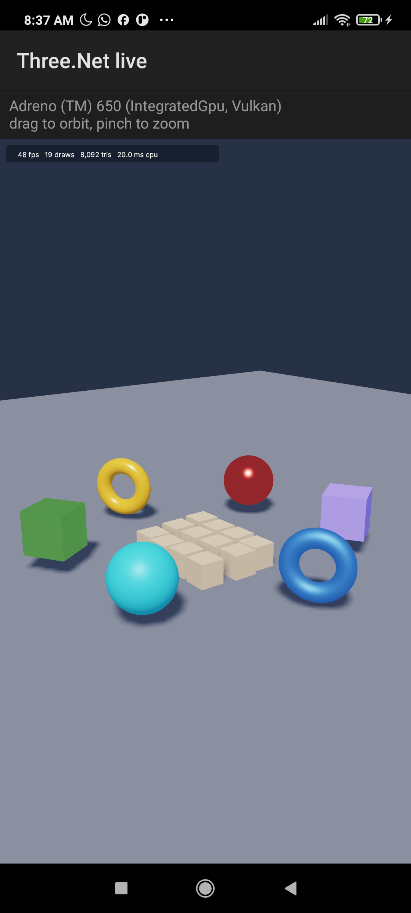
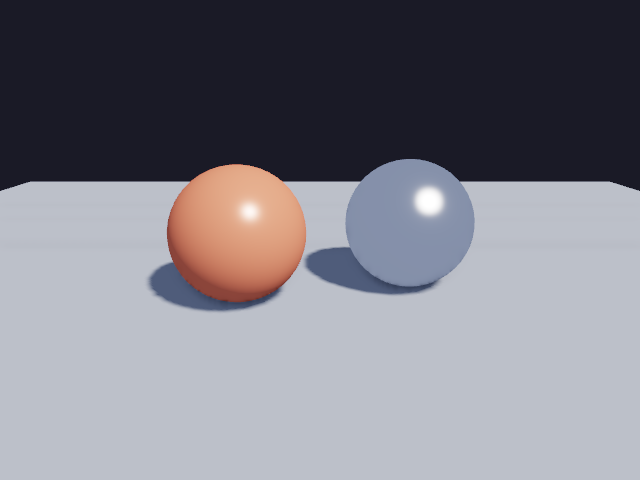

# Platforms / Platform

Three.Net ships one C ABI on every platform; `ThreeNet.Native` carries a binary per runtime identifier.
Features that need platform services compile to stubs where they are unavailable, so the same managed
code runs everywhere and reports "not included in this build" instead of failing to load.

| Runtime | Binary | Graphics | Build | Status |
|---|---|---|---|---|
| `win-x64` | `threenet_core.dll` | DX12 (Vulkan via `WGPU_BACKEND`) | CI + local | tested (GPU tests on real hardware; CI uses WARP) |
| `linux-x64` | `libthreenet_core.so` | Vulkan / GLES | CI | built and tested in CI (GPU tests skip without an adapter) |
| `osx-arm64` | `libthreenet_core.dylib` | Metal | CI | built and tested in CI |
| `osx-x64` | `libthreenet_core.dylib` | Metal | CI (cross) | built |
| `android-arm64`, `android-x64` | `libthreenet_core.so` (API 26+) | Vulkan / GLES | CI + local (NDK) | built; emulator smoke test in CI |
| `ios-arm64`, `iossimulator-arm64` | `libthreenet_core.a` (static) | Metal | CI | built, not device tested |
| `browser-wasm` | `libthreenet_core.a` (Emscripten, static) | WebGL2 (GLES backend) | CI + local | built, not browser tested |

## Build features

| Cargo feature | Default | What it adds | Left out on |
|---|---|---|---|
| `basis` | yes | Basis Universal transcoding (C++) | browser |
| `audio-output` | yes | cpal audio device (the mixer and decoders are always built) | browser |
| `gamepad` | yes | physical gamepads via gilrs (virtual pads always work) | browser |
| `xr` | yes | OpenXR runtime discovery | browser |
| `gltf-lights` | yes | KHR_lights_punctual import | - |

Native windows (`AppWindow`, winit) are not built for Android and the browser: those hosts own the surface.
Render into the host's own surface instead - `Renderer.CreateForAndroid` on Android - or offscreen with
`Renderer.CreateOffscreen` (Avalonia's `ThreeNetView` already does).

## Android

```bash
cargo install cargo-ndk
export ANDROID_NDK_HOME=<ndk>                     # NDK r26+; API 26 is required for AAudio
cargo ndk -t arm64-v8a -t x86_64 --platform 26 build --release --manifest-path rust/threenet-core/Cargo.toml
```

`rust/.cargo/config.toml` links the C++ runtime statically, so the library has no `libc++_shared.so`
dependency. With the NuGet package, `runtimes/android-*/native/libthreenet_core.so` is picked up automatically. From source,
add the libraries as `AndroidNativeLibrary` items like `samples/ThreeNet.Samples.Android`.

That sample has both ways of drawing on a phone:

- **Offscreen** (`MainActivity`): renders a scene with PBR, physics and the HUD, reads the pixels back into a
  `Bitmap` and shows it in an `ImageView`. It logs `THREENET_OK` with the adapter name, which is what the CI
  emulator job greps for.
- **Live** (`LiveActivity`): draws straight into a `SurfaceView` at display rate. The Java `Surface` becomes the
  native window handle with `ANativeWindow_fromSurface` from `libandroid.so`, and that pointer goes to
  `Renderer.CreateForAndroid`:

```csharp
[DllImport("android")] static extern nint ANativeWindow_fromSurface(nint env, nint surface);

nint window = ANativeWindow_fromSurface(JNIEnv.Handle, holder.Surface!.Handle);
using Renderer renderer = Renderer.CreateForAndroid(window, RendererOptions.Default with
{
    Width = width, Height = height, VSync = true, MsaaSamples = 4, Shadows = true,
});
```

The caller keeps the window: release it with `ANativeWindow_release` only after the renderer is disposed, and
tear the renderer down in `SurfaceDestroyed` before the surface goes away. Rendering runs on its own thread;
`Resize` follows `SurfaceChanged`.



Measured on a Xiaomi M2012K11AG (Snapdragon 870, Adreno 650, Android 11): the live viewport runs at 1080x1951
with 4x MSAA, cascaded shadows and bloom at around 48 fps, and the offscreen smoke test reports
`Adreno (TM) 650 (IntegratedGpu, Vulkan)`.

## macOS



Verified on an Apple M1 (macOS 13.4): the core picks the **Metal** backend and reports
`Apple M1 (IntegratedGpu, Metal)`. Two differences from the Direct3D 12 and Vulkan backends are worth
planning for, and both show up in `Renderer.Capabilities`:

| Capability | Metal on M1 |
|---|---|
| `TimestampQueries` | **no** - `FrameStats.GpuTimeMs` stays 0; measure with CPU time there |
| `MaxMsaaSamples` | **4**, where Direct3D 12 offers 8 |
| BC, ETC2 and ASTC textures | all supported |
| `Float32Filterable` | no |

Ask the capabilities rather than assuming: DemoGraphics clamps its quality presets with
`RenderControls.ClampTo(capabilities)` for exactly this reason.

The dylib CI ships has `@rpath/libthreenet_core.dylib` as its install name, so a native consumer can link it
from an app bundle. A dylib built locally keeps its build path instead, which is fine on that machine; run
`install_name_tool -id @rpath/libthreenet_core.dylib` before shipping one.

## iOS

The package's `buildTransitive` targets add `libthreenet_core.a` as a `NativeReference` (force loaded, with
`-lc++`), and the managed resolver binds P/Invokes to the main program. The binaries are built in CI on macOS
(`cargo rustc --crate-type staticlib --target aarch64-apple-ios`).

## Browser (WebAssembly)

```bash
cargo rustc --lib --release --manifest-path rust/threenet-core/Cargo.toml --target wasm32-unknown-emscripten \
  --no-default-features --features gltf-lights --crate-type staticlib
```

`buildTransitive` adds the static library as a `NativeFileReference` for `browser-wasm` apps (requires the
`wasm-tools` workload). wgpu uses its GLES backend on Emscripten (WebGL2).

---

Three.Net - Gravicode Studios, led by Kang Fadhil.
