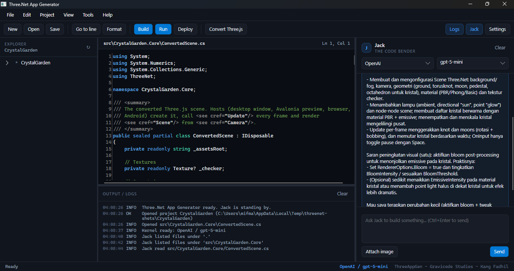

# ThreeAppGen - Three.Net App Generator

A code editor with an AI assistant, **Jack - The Code Bender**, that builds Three.Net applications from prompts,
and converts Three.js projects.
Editor kode dengan asisten AI **Jack - The Code Bender** untuk membuat aplikasi Three.Net dari prompt, serta
mengonversi project Three.js.

```bash
dotnet run --project apps/ThreeAppGen
dotnet run --project apps/ThreeAppGen -- --convert samples/threejs/crystal-garden   # opens the converter page
```



*Jack reads the project with its tools (see the logs panel) and answers in the user's language.*

## Layout / Tata letak

| Area | Features |
|---|---|
| Menu | File (New project, Open project folder, Open file, Save, Close project, Exit), Edit (Go to line, Format code), Project (Build, Run, Deploy), View (line numbers, word wrap, chat panel, logs), Tools (Convert Three.js project, Settings), Help |
| Toolbar | New, Open, Save, Go to line, Format, Build, Run, Deploy, Convert Three.js, Logs, Jack, Settings |
| Left | Explorer tree of the open project (ignores bin/obj/.git) |
| Centre | AvaloniaEdit editor: syntax highlighting (C#, XML, JSON, Markdown), toggleable line numbers, caret position, modified marker |
| Right | Chat with Jack: provider and model pickers, streaming replies, image attachments, **Ctrl+Enter** to send, Stop, Clear. Resizable and hideable |
| Bottom | Output / logs panel (tool calls, file writes, build output) and status bar |

**New project** offers *Blank* or *From template*: spinning cube, solar system, procedural terrain, endless
runner game, particle lab, bouncing ball simulator and an Avalonia product viewer. Generated projects reference
the Three.Net sources of the checkout, so they build immediately.

**Format code** uses Roslyn. **Build/Run/Deploy** run `dotnet build`, `dotnet run` and
`dotnet publish -c Release -r win-x64 --self-contained -o publish`.

## Settings (app.config)

Everything is stored in `app.config` next to the executable and editable in **Settings**:

| Key | Meaning |
|---|---|
| `Llm.Provider` | `OpenAI`, `Claude`, `Gemini` or `Ollama` |
| `Llm.Temperature`, `Llm.MaxTokens`, `Llm.SystemPrompt` | Generation parameters and extra instructions |
| `<Provider>.Model`, `<Provider>.ApiKey`, `<Provider>.Endpoint` | Per provider settings |
| `Tavily.ApiKey` | Internet search |
| `Editor.*`, `Workspace.*` | Editor preferences, last project, chat panel width/visibility |

Provider notes:
- **OpenAI**: empty endpoint for api.openai.com; any OpenAI compatible endpoint (DeepSeek, LM Studio, vLLM);
  an `*.openai.azure.com` endpoint switches to **Azure OpenAI** (the model field is the deployment name).
  Reasoning models (`gpt-5*`, `o*`) automatically omit temperature.
- **Claude**: Anthropic SDK chat client adapted to Semantic Kernel.
- **Gemini**: Google AI connector. **Ollama**: local endpoint, default `http://localhost:11434`.

## Kernel functions / Fungsi kernel

| Plugin | Functions |
|---|---|
| `ProjectPlugin` | `ListFiles`, `ReadFile`, `WriteFile`, `DeleteFile`, `CreateDirectory`, `SearchInFiles`, `CreateProject`, `AddNuGetPackage`, `BuildProject` |
| `ThreeNetPlugin` | `GetThreeNetApi(topic)`, `ListTemplates`, `GetTemplateCode` |
| `WebPlugin` | `SearchInternet` (Tavily), `ScrapeWebPage` |
| `UtilityPlugin` | `MathCalculation`, `GetCurrentDateTime`, `DaysBetween`, `GetSystemInfo`, `GenerateGuid` |

All file operations are confined to the open project folder. Jack is instructed to look up the Three.Net API
before writing rendering code, write real files, build, and fix its own compiler errors.

## Three.js conversion

See [threejs-conversion.md](threejs-conversion.md).

---
ThreeAppGen - Gravicode Studios, led by Kang Fadhil.
