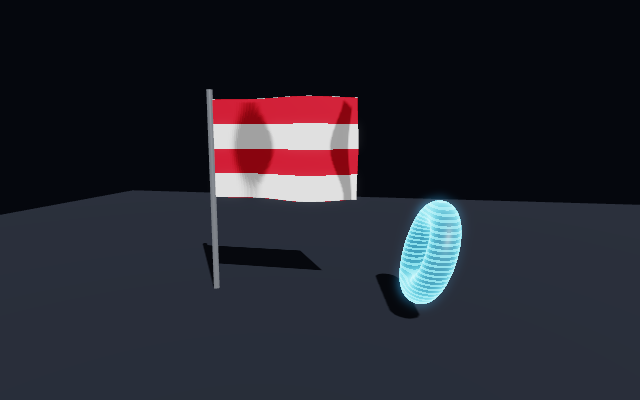
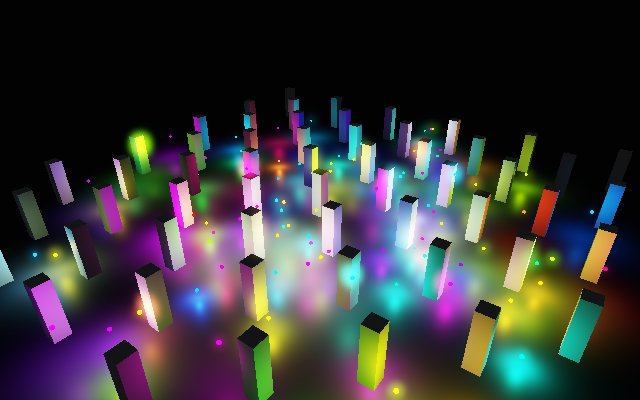
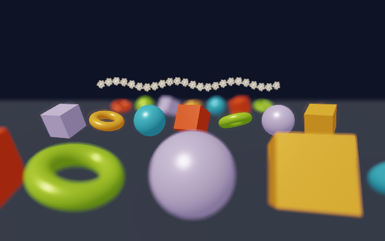

# ThreeGallery

An Avalonia application that showcases Three.Net features next to the code that produces them.
Aplikasi Avalonia yang menampilkan fitur Three.Net berdampingan dengan kode sumbernya.

```bash
dotnet run --project apps/ThreeGallery
```


| Bloom & tone mapping | PBR sweep |
|---|---|
|  |  |
| **Shadows & SSAO** | **Custom shaders** |
|  |  |
| **Deferred: 100 lights** | **Depth of field & motion blur** |
|  |  |

## Layout / Tata letak

- **Left**: samples grouped by category, with search.
- **Centre**: live `ThreeNetView` with a stats HUD (fps, draw calls, triangles, culled nodes), toolbar
  (reset view, auto-rotate, pause, screenshot to `Pictures/ThreeNet`) and orbit controls (drag, right drag,
  wheel). Clicking sends a picking ray to the sample.
- **Right**: the sample's source with C# highlighting and a copy button.
- **Status bar**: current sample, credits.

## Samples / Contoh

| Category | Sample |
|---|---|
| Basics | Primitives |
| Materials | Shading models, PBR sweep, Textures, Texture streaming & KTX2, Custom shaders, Transparency |
| Lighting | Lights, Shadows & SSAO, Deferred: 100 lights |
| Post-processing | Bloom & tone mapping, Depth of field & motion blur |
| Environment | Fog & depth |
| Scene graph | Scene graph (solar system) |
| Animation | Animated geometry (96×96 height field), Keyframe & skeletal animation |
| Interaction | Raycast picking, Interaction & HUD (node events, HUD buttons, gamepad) |
| Physics | Physics & spatial audio |
| Performance | 1000 objects |

## Adding a sample / Menambah contoh

1. Create `apps/ThreeGallery/Samples/MySample.cs` deriving from `GallerySample`.
2. Implement `Title`, `Category`, `Summary` and `Build(Scene)`; optionally `Update`, `ConfigureCamera`,
   `ConfigureRenderer` and `OnPick`.
3. Register it in `SampleCatalog.All`.

Every `Samples/*.cs` file is embedded at build time, so the code panel shows it automatically.
